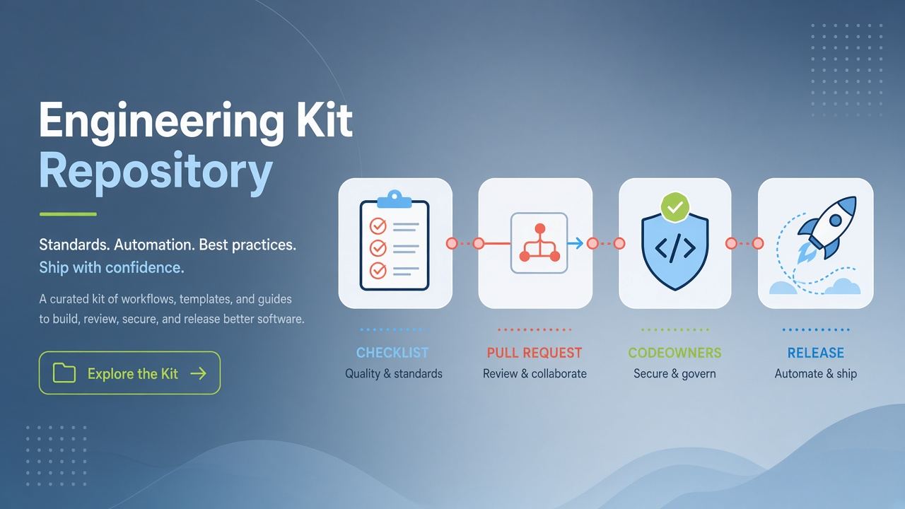

<p align="center">
  
</p>

<h1 align="center">engenharia-kit</h1>

<p align="center">
  <strong>EN</strong> PR/issue templates, CODEOWNERS &amp; engineering checklists — copy into any repo<br/>
  <strong>PT</strong> Templates de PR/issue, CODEOWNERS e checklists — copia para qualquer repositório
</p>

<p align="center">
  <a href="https://github.com/manansbdb/engenharia-kit/blob/main/LICENSE"></a>
  
  
  <a href="#support--apoio"></a>
</p>

---

## What it does / Para que serve

| English | Português |
|---------|-----------|
| A **drop-in engineering kit** so teams start with solid PR/issue hygiene and review/release rituals. | Um **kit de engenharia pronto a copiar** para PR/issues e rituais de review/release. |
| No runtime dependencies — only Markdown files. | Sem dependências de runtime — só ficheiros Markdown. |


---

## Install / Instalação

### 1) Clone this kit / Clona este kit

```bash
git clone https://github.com/manansbdb/engenharia-kit.git
cd engenharia-kit
```

### 2) Copy into your project / Copia para o teu projeto

```bash
# from your application repository root:
cp -R /path/to/engenharia-kit/.github .
cp -R /path/to/engenharia-kit/checklists ./docs/checklists

# optional CODEOWNERS
cp .github/CODEOWNERS.example .github/CODEOWNERS
# edit handles / edita os @usernames
```

### 3) Commit / Faz commit

```bash
git add .github docs/checklists
git commit -m "chore: add engineering kit templates"
git push
```

### Requirements / Requisitos

- `git`
- Any GitHub (or compatible) repository
- No Node/Python install required

---

## What's included / O que inclui

| Path | Purpose / Função |
|------|------------------|
| `.github/PULL_REQUEST_TEMPLATE.md` | PR template EN+PT |
| `.github/ISSUE_TEMPLATE/*` | Bug + feature templates |
| `.github/CODEOWNERS.example` | Ownership starter |
| `checklists/code-review.md` | Review checklist |
| `checklists/release.md` | Release checklist |
| `checklists/incidente.md` | Incident checklist |

---

## Support / Apoio

```
bc1q0qfnlnxyum9u45stzxe0a7jnhtj4j0usfkqdjw
```

See [SUPPORT.md](./SUPPORT.md).

---

## License / Licença

[MIT](./LICENSE) © 2026 manansbdb
